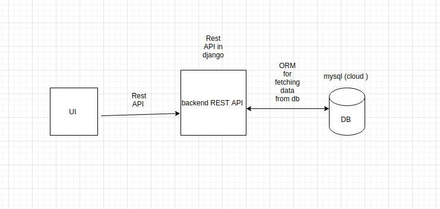
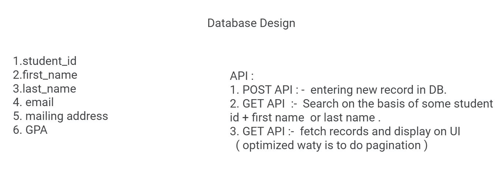
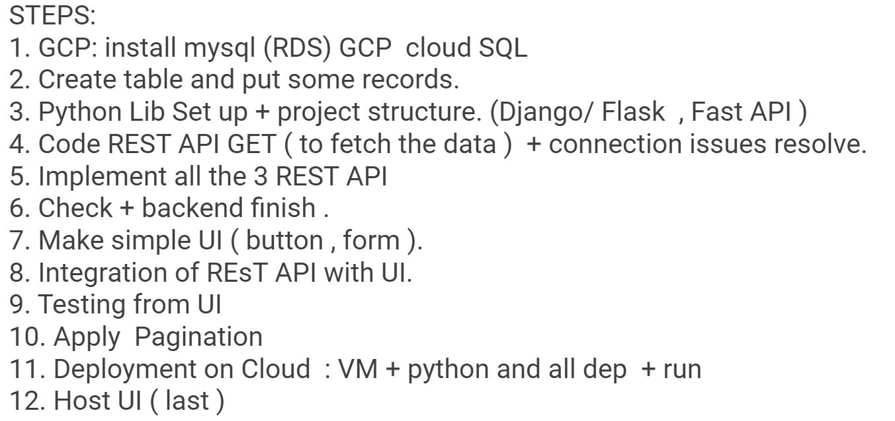

# StudentInfoApp
Basic Student Database App developed using FASTapi and deployed on GCP's Compute Engine

Introduction: This project focuses on demonstrating the use of GCP as a cloud service for hosting websites on the cloud and leveraging the computing capabilities made available to the developers and users by Google’s Distributed computing systems. Software Environment: The software environment is divided into several integral parts:

1. Backend: FastAPI – FastAPI is Python’s framework for backend web development. It is like other Python Web-Dev frameworks like Django and Flask, but it is faster when it comes to querying time from databases. Additionally, it is beginner-friendly and easy to learn. Modern versions of Python that is Python 3.6+ have support for asynchronous code that is the machine can perform several operations in the background while waiting for a slow process.

2. Backend: GCP Cloud SQL (MySQL Instance) – GCP provides a most convenient way to set up and work with databases on their platform, you can connect and work on a separate database instance hosted on the cloud from anywhere in the world. In this case, a minimal MySQL instance was created with 10GBs of HDD space and 3.75GB VRAM Memory with 1 VCPUs.

3. Backend: Uvicorn Web Server – Uvicorn is an ASGI server implementation, ASGI stands for Asynchronous Server Gateway Interface and is the successor of WSGI (Web Server Gateway Interface) which is basically a Python standard for compatibility between applications and web servers.

4. Backend: GCP Compute Engine VM – For this implementation GCP Compute Engine VM has been used to stage the web app and host it using Uvicorn web server. The web app currently resides on the Ubuntu 20.04 LTS Virtual Machine with a low-end configuration that is it has 10GBs of HDD space a VRAM of 4GB.

5. Frontend: Basic HTML, CSS, and JavaScript.

